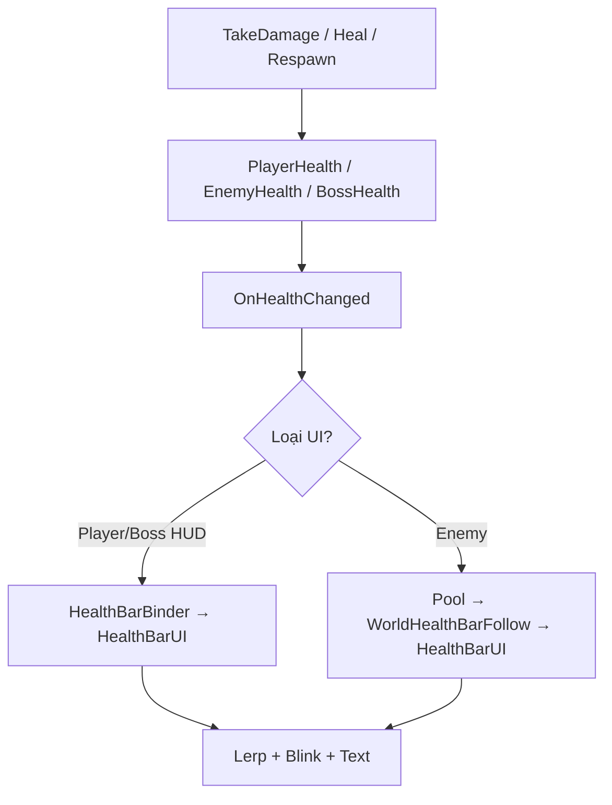

# Hệ thống Health Bar — Hướng dẫn setup chi tiết (Unity Editor)

Code: `Assets/scrip/HealthBar/`  
Script máu đã tích hợp: `PlayerHealth`, `EnemyHealth`, `BossHealth`.

---

## Mục lục

1. [Chuẩn bị trước khi làm](#1-chuẩn-bị-trước-khi-làm)
2. [Thanh máu Player (HUD Screen Space)](#2-thanh-máu-player-hud-screen-space)
3. [Cách gắn dữ liệu Player vào UI](#3-cách-gắn-dữ-liệu-player-vào-ui)
4. [Thanh máu Enemy (World Space + Pool)](#4-thanh-máu-enemy-world-space--pool)
5. [Thanh máu Boss](#5-thanh-máu-boss)
6. [Kiểm tra & xử lý lỗi thường gặp](#6-kiểm tra--xử-lý-lỗi-thường-gặp)
7. [Tối ưu khi nhiều enemy](#7-tối-ưu-khi-nhiều-enemy)

---

## 1. Chuẩn bị trước khi làm

### 1.1. GameObject Player

1. Mở scene có nhân vật (ví dụ scene gameplay).
2. Chọn object **Player** trong Hierarchy.
3. **Inspector → Tag** = `Player` (nếu chưa có: *Add Tag…* → tạo `Player` → gán lại).
4. Đảm bảo có component **`PlayerHealth`**:
   - `Max Health`: ví dụ `100`
   - `Current Health`: sẽ tự về max khi Play (trong `Awake`)

### 1.2. Canvas gameplay (nếu chưa có)

1. **Hierarchy → chuột phải → UI → Canvas**.
2. Unity tạo kèm **EventSystem** — giữ nguyên.
3. Chọn **Canvas**:
   - **Render Mode**: `Screen Space - Overlay`
   - **UI Scale Mode**: `Scale With Screen Size`
   - **Reference Resolution**: `1920 x 1080` (hoặc resolution game bạn)
   - **Match**: `0.5` (cân bằng width/height)

> Nếu project đã có Canvas menu/HUD, thêm thanh máu **bên trong Canvas đó**, không tạo Canvas thứ hai.

---

## 2. Thanh máu Player (HUD Screen Space)

Có **2 kiểu UI** — chọn **một** trong hai (Slider **hoặc** Image Fill).

---

### Phương án A — Dùng Slider (dễ nhất, khuyên dùng lần đầu)

#### Bước A1: Tạo khung thanh máu

1. Chọn **Canvas** → chuột phải → **UI → Panel**.
2. Đổi tên: `Panel_PlayerHealth`.
3. **Rect Transform** (góc trên-trái màn hình):
   - Anchor Preset: giữ **Alt** + click **top-left**
   - Pos X: `120`, Pos Y: `-40`
   - Width: `280`, Height: `50`
4. **Image** (Panel): màu đen alpha ~`150` (nền mờ) hoặc tắt **Raycast Target** nếu không cần click.

#### Bước A2: Tạo Slider

1. Chuột phải `Panel_PlayerHealth` → **UI → Slider**.
2. Đổi tên: `Slider_Health`.
3. **Rect Transform**: Stretch full panel
   - Anchor: stretch-stretch (Alt + click ô giữa dưới cùng)
   - Left/Right/Top/Bottom: `10` mỗi cạnh
4. Chọn **Slider_Health** → component **Slider**:
   - **Min Value**: `0`
   - **Max Value**: `1`
   - **Whole Numbers**: tắt
   - **Value**: `1`
   - **Interactable**: **tắt** (thanh máu không cần kéo tay)

#### Bước A3: Chỉnh màu Background / Fill

1. Mở rộng `Slider_Health` trong Hierarchy:
   ```
   Slider_Health
   ├── Background
   ├── Fill Area
   │   └── Fill
   └── Handle Slide Area   ← có thể xóa hoặc tắt
   ```
2. **Background** → **Image**: màu xám đậm `#3A3A3A`.
3. **Fill** → **Image**: màu đỏ `#C62828` hoặc xanh lá `#2E7D32`.
4. (Tùy chọn) Xóa **Handle Slide Area** hoặc disable GameObject — thanh máu không cần nút kéo.

#### Bước A4: Text hiển thị số (tùy chọn)

1. Chuột phải `Panel_PlayerHealth` → **UI → Text - TextMeshPro**.
   - Lần đầu Unity hỏi import TMP Essentials → **Import**.
2. Đổi tên: `Text_Health`.
3. **Rect Transform**: căn giữa panel, Width `260`, Height `40`.
4. **TextMeshPro**:
   - Text: `100 / 100`
   - Font Size: `22`
   - Alignment: căn giữa
   - Color: trắng

#### Bước A5: Gắn script `HealthBarUI`

1. Chọn **`Panel_PlayerHealth`** (root panel).
2. **Add Component** → gõ `HealthBarUI` → chọn script.
3. Điền Inspector:

| Field | Giá trị |
|--------|---------|
| **Fill Mode** | `Slider` |
| **Text Mode** | `Current Over Max` (hoặc `None` nếu không có chữ) |
| **Slider** | Kéo `Slider_Health` từ Hierarchy vào |
| **Fill Image** | để trống |
| **Health Text** | Kéo `Text_Health` (TMP) |
| **Smooth → Enabled** | ✓ |
| **Smooth → Smooth Speed** | `8` |
| **Smooth → Use Delay Bar** | tắt (chỉ dùng khi có 2 lớp Image) |
| **Blink → Enabled** | ✓ |
| **Blink → Damage Flash Color** | đỏ nhạt |
| **Blink → Flash Count** | `3` |
| **Blink → Flash Interval** | `0.08` |
| **Blink Target** | Kéo **Fill** (Image trong Slider) — nếu để trống script tự tìm |

#### Bước A6: Gắn `HealthBarBinder`

1. Vẫn trên `Panel_PlayerHealth` → **Add Component** → `HealthBarBinder`.
2. Inspector:

| Field | Giá trị |
|--------|---------|
| **Health Bar UI** | Kéo chính component `HealthBarUI` trên cùng object (hoặc object chứa nó) |
| **Health Provider Component** | Kéo object **Player** từ Hierarchy (phải có `PlayerHealth`) |
| **Bind On Enable** | ✓ |
| **Unbind On Disable** | ✓ |

---

### Phương án B — Dùng Image Fill (không dùng Slider)

#### Bước B1: Panel

Giống **A1** — tạo `Panel_PlayerHealth`.

#### Bước B2: Background + Fill

1. Chuột phải Panel → **UI → Image** → tên `Img_Background`.
   - Màu xám đậm, kích thước full panel.
2. Chuột phải Panel → **UI → Image** → tên `Img_Fill`.
   - Màu đỏ/xanh, **cùng kích thước** Background.
3. Chọn **`Img_Fill`** → **Image**:
   - **Image Type**: `Filled`
   - **Fill Method**: `Horizontal`
   - **Fill Origin**: `Left`
   - **Fill Amount**: `1`

4. (Tùy chọn — hiệu ứng “vệt máu”) thêm `Img_DelayFill` phía sau `Img_Fill`, màu đỏ đậm hơn, cùng Fill settings → kéo vào **Delay Fill Image** trên `HealthBarUI`.

#### Bước B3: `HealthBarUI` trên Panel

| Field | Giá trị |
|--------|---------|
| **Fill Mode** | `Image Fill` |
| **Fill Image** | `Img_Fill` |
| **Delay Fill Image** | `Img_DelayFill` (nếu có) |
| **Slider** | để trống |
| Các mục khác | giống phương án A |

---

## 3. Cách gắn dữ liệu Player vào UI

### Cách 1 — Kéo tham chiếu (khuyên dùng)

- Trên `HealthBarBinder` → **Health Provider Component** = object có `PlayerHealth`.
- **Play**: thanh tự cập nhật khi `TakeDamage` / `Heal` / hồi sinh.

### Cách 2 — Tự tìm Player theo Tag

1. Chọn **Canvas** (hoặc object quản lý UI).
2. **Add Component** → `HealthBarBootstrap`.
3. Inspector:
   - **Player Hud Binder**: kéo object có `HealthBarBinder` (`Panel_PlayerHealth`).
   - **Player Tag**: `Player`
4. Trên `HealthBarBinder` có thể **để trống** Health Provider — Bootstrap gán lúc `Start`.

> Chỉ dùng **một** cách (1 hoặc 2), tránh bind trùng.

### Thử nhanh trong Play Mode

1. Chọn **Player** → `PlayerHealth` → trong Play có thể gọi damage từ enemy.
2. Hoặc tạm thêm script test trên Player:
   - Phím `H` → `TakeDamage(10)`
   - Phím `J` → `Heal(10)`
3. Kỳ vọng:
   - Mất máu: thanh **giảm mượt** + **nhấp nháy đỏ**.
   - Hồi máu: thanh **nhảy lên ngay** (không lerp chậm).
   - Text: `85 / 100` (ví dụ).

---

## 4. Thanh máu Enemy (World Space + Pool)

### 4.1. Tạo prefab thanh máu world

#### Bước 1: Root prefab

1. **Hierarchy → Create Empty** → tên `WorldEnemyHealthBar`.
2. **Add Component**:
   - `World Health Bar Follow`
   - `Canvas Group` (để ẩn khi đủ máu)

3. **World Health Bar Follow**:

| Field | Giá trị gợi ý |
|--------|----------------|
| **World Offset** | `(0, 1.2, 0)` — cao hơn đầu enemy 2D |
| **Face Camera** | ✓ |
| **Hide When Full** | ✓ |
| **Canvas Group** | kéo Canvas Group trên cùng object |

#### Bước 2: UI con bên trong (khi KHÔNG dùng Shared Canvas)

> Nếu bật **Use Shared World Canvas** trên Pool (khuyên dùng), prefab **vẫn cần** nội dung UI dưới dạng child; Pool sẽ reparent cả prefab vào canvas chung.

1. Chuột phải `WorldEnemyHealthBar` → **UI → Canvas**.
   - Đổi tên: `BarCanvas`
2. Chọn `BarCanvas`:
   - **Render Mode**: `World Space`
   - **Rect Transform**: Width `2`, Height `0.25` (đơn vị world — chỉnh trong Play cho vừa)
   - **Scale**: `(0.01, 0.01, 0.01)` hoặc scale root để bar ~2–3 unit rộng trên scene

#### Bước 3: Hình ảnh thanh máu

Cấu trúc gợi ý:

```
WorldEnemyHealthBar          ← WorldHealthBarFollow + CanvasGroup
└── BarCanvas                ← Canvas World Space
    └── BarRoot              ← Empty, stretch
        ├── Img_Background   ← Image xám
        └── Img_Fill         ← Image đỏ, Type = Filled Horizontal
```

1. Tạo **Empty** `BarRoot` dưới `BarCanvas`, Rect stretch full.
2. **Img_Background**: Image đen/xám, alpha ~200.
3. **Img_Fill**: Image đỏ, **Filled / Horizontal / Left**, Fill Amount = 1.

#### Bước 4: `HealthBarUI` trên prefab

1. Add `HealthBarUI` lên **`BarRoot`** (hoặc `WorldEnemyHealthBar` — miễn kéo đúng reference).
2. Inspector:

| Field | Giá trị |
|--------|---------|
| **Fill Mode** | `Image Fill` |
| **Text Mode** | `None` (enemy thường không cần số) |
| **Fill Image** | `Img_Fill` |
| **Smooth → Enabled** | ✓ |
| **Smooth Speed** | `10` |
| **Blink → Enabled** | ✓ (tùy chọn) |

3. **Kéo prefab** vào thư mục Project, ví dụ:  
   `Assets/Prefabs/UI/WorldEnemyHealthBar.prefab`  
4. **Xóa** bản copy trong Hierarchy (giữ prefab).

---

### 4.2. `HealthBarPoolManager` trong scene

1. **Hierarchy → Create Empty** → `HealthBarSystems`.
2. **Add Component** → `Health Bar Pool Manager`.
3. Inspector:

| Field | Giá trị |
|--------|---------|
| **World Bar Prefab** | Kéo prefab `WorldEnemyHealthBar` |
| **Pool Root** | để trống (tự tạo child `HealthBarPool`) |
| **Prewarm Count** | `20` (≥ số enemy tối đa cùng lúc) |
| **Max Pool Size** | `64` |
| **Use Shared World Canvas** | ✓ |
| **Shared World Canvas** | để trống (tự tạo lúc Play) |

4. **Thứ tự load scene**: object này phải **active** trước khi enemy spawn. Đặt trong scene gameplay chính, không đặt trong menu.

---

### 4.3. Gắn lên prefab Enemy

1. Mở **prefab Enemy** (object có `EnemyHealth` + `EnemyAI`).
2. **Add Component** → `Enemy Health Bar Anchor`.
3. Inspector:

| Field | Giá trị |
|--------|---------|
| **Bar Offset** | `(0, 1.2, 0)` — chỉnh nếu bar che mặt quái |

4. Trên **`EnemyHealth`** (cùng prefab):

| Field | Giá trị |
|--------|---------|
| **Max Health** | ví dụ `50`, `100` (bắt buộc set — dùng cho % thanh máu) |
| **Current Health** | ≤ Max Health |

5. **Apply** prefab.

> Không cần kéo reference bar thủ công — `EnemyHealthBarAnchor` tự gọi Pool khi `OnEnable`.

---

### 4.4. Kiểm tra enemy bar

1. Play scene có `HealthBarSystems` + enemy.
2. Đánh enemy một nhát:
   - Thanh xuất hiện phía trên (nếu trước đó ẩn vì full máu).
   - Fill giảm, có thể nhấp nháy.
3. Enemy chết / disable → bar biến mất (trả pool).
4. Chọn `HealthBarSystems` khi Play → script Pool có thể debug qua `ActiveCount` (trong code / thêm `[SerializeField]` debug nếu cần).

---

## 5. Thanh máu Boss

Boss thường dùng **HUD cố định** (giống Player), to và nổi bật.

1. Trên Canvas gameplay → **Panel_BossHealth** (đặt **giữa trên** màn hình).
   - Width `600`, Height `40`, Anchor top-center.
2. Dùng **Image Fill** (2 lớp) hoặc **Slider** — giống mục 2.
3. `HealthBarUI`:
   - Text Mode: `Current Over Max` (khuyên có số cho boss).
   - Smooth Speed: `5` (chậm hơn player, dramatic).
4. `HealthBarBinder` → **Health Provider** = object Boss có **`BossHealth`**.
5. Mặc định ẩn panel; script `BossAI` / cutscene có thể `SetActive(true)` khi vào trận boss.

---

## 6. Kiểm tra & xử lý lỗi thường gặp

| Triệu chứng | Nguyên nhân | Cách sửa |
|-------------|-------------|----------|
| Thanh không đổi khi đánh | Chưa bind Provider | Kéo `PlayerHealth` vào `HealthBarBinder` hoặc dùng Bootstrap + tag `Player` |
| Text luôn `100/100` | Chưa kéo TMP vào **Health Text** hoặc Text Mode = None | Bật `Current Over Max` + gán Text |
| Slider không giảm | Fill Mode = Slider nhưng chưa kéo Slider | Kiểm tra **Slider** field và Min/Max = 0–1 |
| Image không giảm | Chưa set Image Type = **Filled** | Chọn Fill Image → Filled Horizontal |
| Enemy không có bar | Không có `HealthBarPoolManager` trong scene | Thêm `HealthBarSystems` + prefab |
| Enemy không có bar | Thiếu `EnemyHealthBarAnchor` | Add lên prefab enemy |
| Bar nằm sai vị trí | Offset sai | Chỉnh **World Offset** / **Bar Offset** |
| Bar quá to/nhỏ | Scale Canvas world sai | Chỉnh Scale `BarCanvas` hoặc Rect 2×0.25 |
| Lỗi “Instance is null” | Pool chưa Awake khi enemy enable | Đảm bảo `HealthBarSystems` active trước enemy; không đặt Pool trên prefab enemy |
| Nhấp nháy không thấy | Blink Target trống / màu trùng nền | Gán **Fill** vào Blink Target, đổi Damage Flash Color |

---

## 7. Tối ưu khi nhiều enemy

1. Bật **Use Shared World Canvas** trên Pool.
2. **Prewarm Count** ≥ số enemy spawn cùng lúc.
3. Enemy bar: **Text Mode = None**.
4. **Hide When Full** = bật — giảm vẽ khi chưa đánh.
5. Tránh mỗi enemy một Canvas riêng ngoài prefab (dùng shared).

---

## Sơ đồ luồng (tóm tắt)



---

## File script tham khảo

| File | Vai trò |
|------|---------|
| `HealthBarUI.cs` | Hiển thị + hiệu ứng |
| `HealthBarBinder.cs` | Nối HUD ↔ Player/Boss |
| `HealthBarPoolManager.cs` | Pool enemy bars |
| `WorldHealthBarFollow.cs` | Theo vị trí enemy |
| `EnemyHealthBarAnchor.cs` | Đăng ký pool |
| `HealthBarBootstrap.cs` | Auto-bind theo tag |
